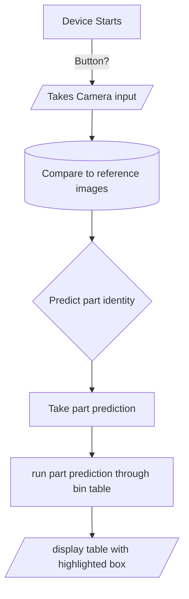

# Project R.a.

## [Home](https://github.com/ezahid82/Engineering_F.e.R.a/tree/main)

The Purpose of Project R.a. is to build an image recognition device using machine learning that identifies various parts around the lab

 
 

---

 
 

## Table of Contents

 
 

AI Recognition: Achievement   |   Date  |
------------- |-------- |
Research | Week 12 |
Begin Code And Wiring | Week 13 - 17 |
Begin CAD And Manufacturing | Week 13 - 17 |
Begin Assembly and Testing | Week 18 - 20 |
Final Testing | Week 21 |
Small Iterations | Week 22 |
Documentation | Week 1-22 |

 
 
 

---

 
 

* The requirements of the AI

 
 

* The Psuedocode for the AI.

 

 
 

 
 

---

 
 
 
 
### Problems and solution/project ideas

 
 

* **Problem:** With almost no experience in machine learning we try and learn how to build an "image recognition device" in 3 months
  
   * **Solution:** Will be under a tight schedule

* **Problem:** It is possible to find a model online, but will need to make our own dataset
  
   * **Solution:** Make a **folder** with lots of **pictures** (.png or .jpg) that are named after the part, before turning them into CSV files

* **Problem:** Wanted to know if a camera filter might help the model to recognize parts more effectively

   * **Solution:** Tested all the possible filters and decided to pick between *Negative, sketch, and watercolor*, but discovered that **sketch** is the same as **watercolor**.

* **Problem:** Found out about **Exposure modes**, and wanted to know its compatibility in making *parts recognition* **easier**.

   * **Solution:** None of these appeared to be too helpful, except for **auto mode**.

* **Problem:** Unsure of how large to make the **enclosure**, the basic outline felt massive, and need a 3:4 aspect ratio and enough room for the camera to focus.

   * **Solution:** Design models out of **cardboard**, and *3D Print* most **effective** design for further testing and finalization.

* **Problem:** Framebuffer would not close without human input

   * **Solution:** I tried to use kill, I tried to create a button that hit enter, but it turned out that there was a set of modifiers on the Framebuffer command that kill it after some time, however the first time I tried it I did not have the "once" modifier in it(-1), so it ended up repeating, but the timer worked. I finally tried both of them together and it actually worked.

* **Problem:** Cannot find a compatible model that works with the device.
  
   * **Solution:** 
 
