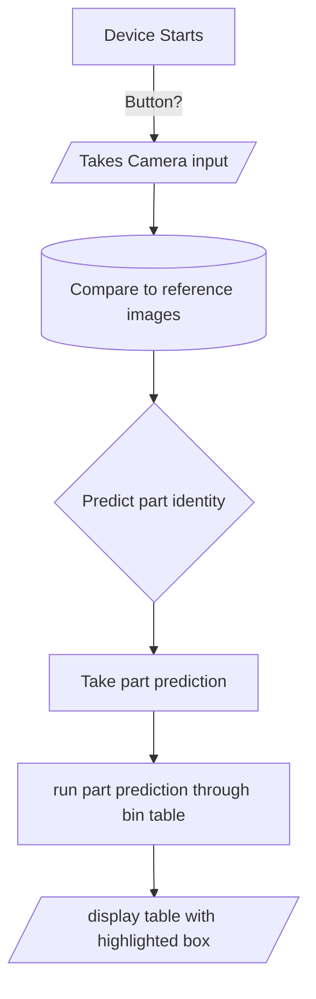

# Project R.a.

## [Home](https://github.com/ezahid82/Engineering_F.e.R.a/tree/main)

The Purpose of Project R.a. is to build an image recognition device using machine learning that identifies various parts around the lab

 
 

---

 
 

## Table of Contents

 

* [Project R.a.](#ai-recognition)
   * [Problems and Solutions](#problems-and-solution)
   * [Images](#images)

---

 
 
 

## Bill of Materials

 

Materials | quantity |
--------- | -------- |
4-40 m-f standoffs | 4 |
Raspberry Pi | 1 |
Pi Camera | 1 |
PTFT 2.8" w/ resistive touch | 1 |
Corner Brackets | 2 |
Angle Brackets | 2 |
4-40 Screws | 24 |
1-72 Screw | 4 |
4-40 Nuts | 24 |
1-72 Nuts | 4 |

 
 
 

---

 
 
 

## Schedule

 
 

AI Recognition: Achievement   |   Date  |
------------- |-------- |
Research | Week 12 |
Begin Code And Wiring | Week 13 - 17 |
Begin CAD And Manufacturing | Week 13 - 17 |
Begin Assembly and Testing | Week 18 - 20 |
Final Testing | Week 21 |
Small Iterations | Week 22 |
Documentation | Week 1-22 |

 
 
 

---

 
 

* The requirements of the AI

 
 

Wiring

 

We have a Raspberry pi with a camera module equipped and a piTFT touchscreen covering all of the GPIO pins

 
 

* The Psuedocode for the AI.

 

 
 

**Space for walls/printed parts**

 
 
 

---

 
 
 

## AI-Recognition

 
 
 

### Description

Use AI to allow students to identify **locations** and **parts** in the lab.

 
 
 

---

 
 
 

### Problems and solution

 
 

* **Problem:** With almost no experience in machine learning we are trying to learn how to build an "image recognition device" in 3 months
  
   * **Solution:** We will be under a tight schedule

* **Problem:** It is possible to find a model online, but we will need to make our own dataset
  
   * **Solution:** Make a **folder** with lots of **pictures** (.png or .jpg) that are named after the part, before turning them into CSV files

* **Problem:** We wanted to know if a camera filter might help the model to recognize parts more effectively

   * **Solution:** Tested all the possible filters and decided to pick between *Negative, sketch, and watercolor*, but discovered that **sketch** is the same as **watercolor**.

* **Problem:** Found out about **Exposure modes**, and wanted to know its compatibility in making *parts recognition* **easier**.

   * **Solution:** None of these appeared to be too helpful, except for **auto mode**.

* **Problem:** We were unsure of how large to make the **enclosure**, the basic outline felt massive, and need a 3:4 aspect ratio and enough room for the camera to focus.

   * **Solution:** Design models out of **cardboard**, and *3D Print* most **effective** design for further testing and finalization.

* **Problem:** Framebuffer would not close without human input

   * **Solution:** I tried to use kill, I tried to create a button that hit enter, but it turned out that there was a set of modifiers on the Framebuffer command that kill it after some time, however the first time I tried it I did not have the "once" modifier in it(-1), so it ended up repeating, but the timer worked. I finally tried both of them together and it actually worked.

* **Problem:** Cannot find a compatible model that works with the device.
  
   * **Solution:** Due to relative project constraints with the materials, It was decided to create a dataset instead for someone to utilize later.

* **Problem:** The walls of the box are **laser cut**, but they are solid and no light can **enter**, making it difficult to see, and since the acrylic used is red, the parts look **red** under the camera.
   * **Solution:** Changed the design of the box to have as much **hollow space** as possible to allow natural light to enter the enclosure.
 
 
 

## Summary

Project R.a. was not finished. We ran out of time to find a compatible model ue to storage issues and did not complete the dataset. The photos gathered are saved to the device but the quantity of each part picture needs to increase (from 10 to 100) when enough storage is present to run a model. The project is clear with instructions (below) for future engineers to pick_up and iterate upon when deciding on a project to complete.

### How to Use what we have

In order to take new pictures for the dataset, plug in the pi and open the documents/python/training.py file on it. That file saves images and requires a name input. There is not file to run a model.

