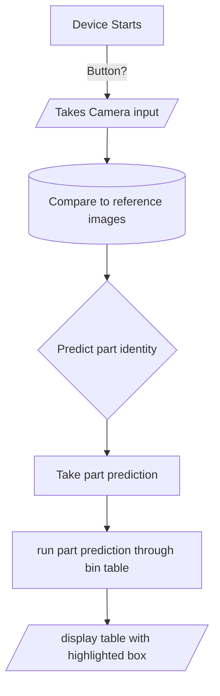

# Project R.a.

## [Home](https://github.com/ezahid82/Engineering_F.e.R.a/tree/main)

The Purpose of Project R.a. is to build an image recognition device using machine learning that identifies various parts around the lab

 
 

---

 
 

## Table of Contents

 
 

AI Recognition: Achievement   |   Date  |
------------- |-------- |
Research | Week 12 |
Begin Code And Wiring | Week 13 - 17 |
Begin CAD And Manufacturing | Week 13 - 17 |
Begin Assembly and Testing | Week 18 - 20 |
Final Testing | Week 21 |
Small Iterations | Week 22 |
Documentation | Week 1-22 |

 
 
 

---

 
 

* The requirements of the AI

 
 

* The Psuedocode for the AI.

 

 
 

 
 

---

 
 
 
 
### Problems and solution/project ideas

* Two people with almost no experience in machine learning decided to try and learn how to build an "image recognition device" in 3 months
   * We have made mistakes, but will just be in crunch time the whole time
   * We are able to find a model online, but we will need to make our own dataset
       * It turns out that we just need to make a folder with lots of pictures(.png or .jpg) that are named after the part, before eventually turning them into CSV files
* We wanted to know if a camera filter might help the model to recognize parts
   * We tested all the possible filters and decided to pick between Negative, sketch, and watercolor, before quickly finding out that sketch was the same as watercolor
* Eventually, Ezhar found out about Exposure modes, so we checked out all of these
   * None of these appeared to be too helpful, but in the testing the auto mode helped slightly
* We were also unsure how large we wanted to make the box, our basic outline felt massive, but we needed a 4:3 aspect ratio and enough room for the camera to focus
   * solution pending
* Framebuffer would not close without human input
   * I tried to use kill, I tried to create a button that hit enter, but it turned out that there was a set of modifiers on the Framebuffer command that kill it after some time, however the first time I tried it I did not have the "once" modifier in it(-1), so it ended up repeating, but the timer worked. I finally tried both of them together and it actually worked.
