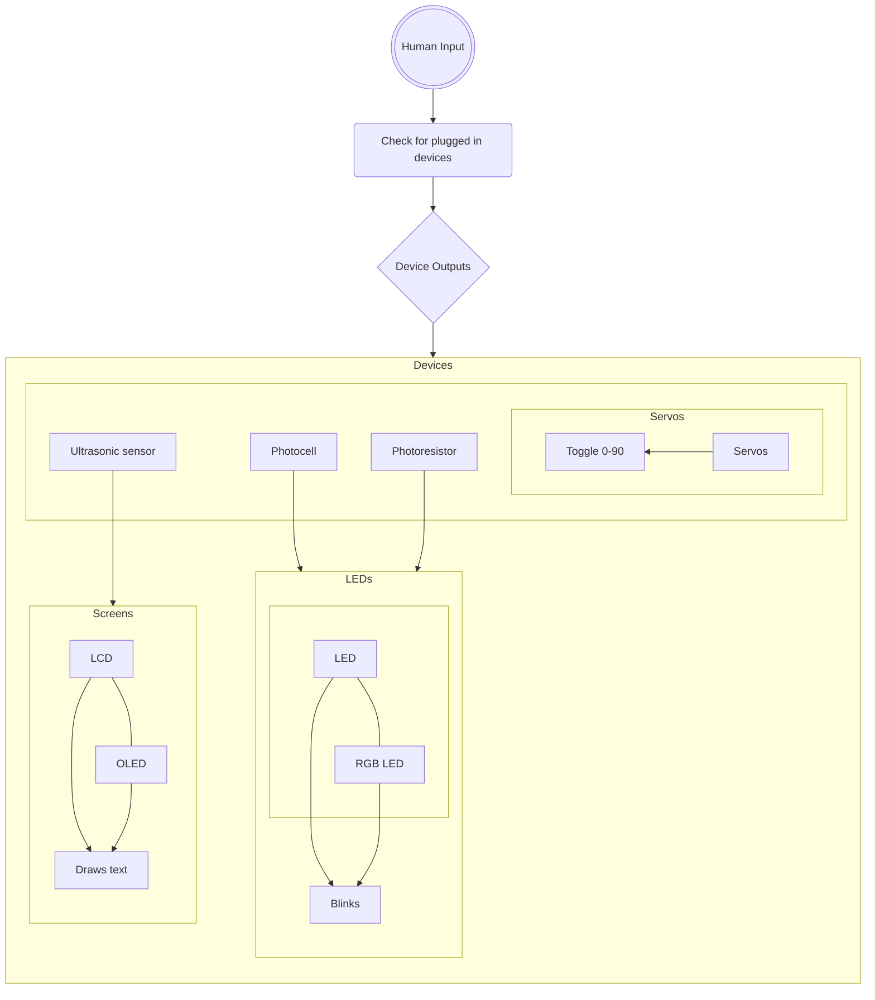

# Engineering_F.e.R.a

Able to test parts in the lab, and identify parts using A.I. recognition
 
 

## Table of Contents
* [Project F.e.](#parts-tester)
   * [Problems and Solutions](#problems-and-solutions)
   * [Description](#description)
   * [Images](#images-progress)
   * [Links](#related-links)

 
 
## Budget
 
$100

   * $50 = party upon completion of Project F.e.
   * $50 = party upon completion of Project R.a.
## Iteration
 
 
The Pseudocode for the Test Box

 
The requirements of the Test Box.

 
The views from different sides of the box. 

 
The requirements of the AI.

 
 

## Parts Tester

 
 
 

### Description
A box that quickly tests certain types of parts

 
 

### Problems and Solutions

 
 

### Images progress

 
 

### Related Links

 
 

