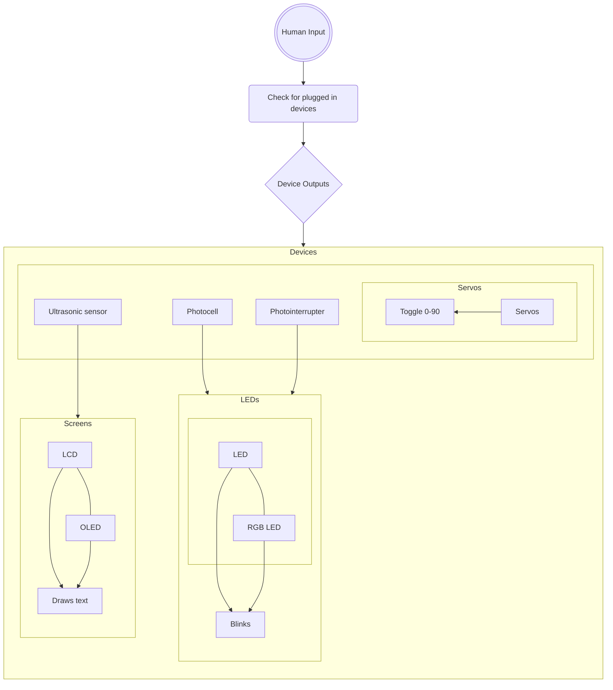

# Engineering_F.e.R.a

Able to test parts in the lab, and identify parts using A.I. recognition
 
 

## Table of Contents
* [Project F.e.](#parts-tester)
   * [Problems and Solutions](#problems-and-solutions)
   * [Description](#description)
   * [Images](#images-progress)
   * [Links](#related-links)

 
 

## Budget

 
$100

   * $50 = party upon completion of Project F.e.
   * $50 = party upon completion of Project R.a.
 
 
 

## Schedule
 
 

Parts Tester: Achievement   |   Date  |
------------- |-------- |
Research | Week 1 |
Begin Code And Wiring | Week 2 - 6 |
Begin CAD And Manufacturing | Week 2 - 6 |
Begin Assembly and Testing | Week 7 - 9 |
Final Testing | Week 10 |
Small Iterations | Week 11 |
Documentation | Week 1-11 |

 
 

AI Recognition: Achievement   |   Date  |
------------- |-------- |
Research | Week 12 |
Begin Code And Wiring | Week 13 - 17 |
Begin CAD And Manufacturing | Week 13 - 17 |
Begin Assembly and Testing | Week 18 - 20 |
Final Testing | Week 21 |
Small Iterations | Week 22 |
Documentation | Week 1-22 |

 
 
 

## Iteration

 
 

   * The Pseudocode for the Test Box
 

 
  *Circuit Diagram of Test Box

 

   * The requirements of the Test Box.
 

 
 

   * The views from different sides of the box. 
 

 
 

   * The requirements of the AI.
 

 
 
 

## Parts Tester

 
 
 

### Description
A box that quickly tests certain types of parts

 
 

### Problems and Solutions

* **Problem:** We didn't remember most of the code, and syntax which made it harder to code the assignment
   
   * **Solution:** Googled different things that would be used in the code so that it could be integrated to work with one another.
 
* **Problem:** The LCD Screen consists of multiple addresses, so knowing which address goes to which LCD Screen, and how the code would integrate all of them created an obstacle.
   
   * **Solution:** Used the most popular addresses and added them to a list that the code can use to reference if an LCD Screen in the lab has it. This would allow a wider array of LCDs to be tested.

* **Problem:** The OLED Code broke the LCD screen's code by adding corrupted text on the display.
   
   * **Solution:** This ended up being an address conflict error when the OLED code found the existence of an address on the LCD. Because it did not understand how to do those things, it created the glitchy text. Just checking typical addresses first solved this problem... for now.
 
* **Problem:** A rail was soldered on the circuit board at an angle.
   
   * **Solution:** Give it a little more space on the cut for the prototype.
     
* **Problem:** A combination of senioritis and Tardies delayed the project.
  
   * **Solution:** Work harder when we are there.
 
* **Problem:** Struggle to decide whether to keep the Photo-interrupter because of the difficulty in preventing short circuits and integrating it into the Box.

   * **Solution:** Remove the part to stay on schedule, and decide whether to add it later.

* **Problem:** Having the **servo,** **RGB LED,** **LED,** and **Photo-resister** separate, and having printed brackets to each, along with their small size is inconvenient and inefficient

   * **Solution:** Have those **four parts** on a small circuit board, and then attach the circuit board to the **Box**.
 

 
 

### Images progress

 
 

### Related Links

 
 

