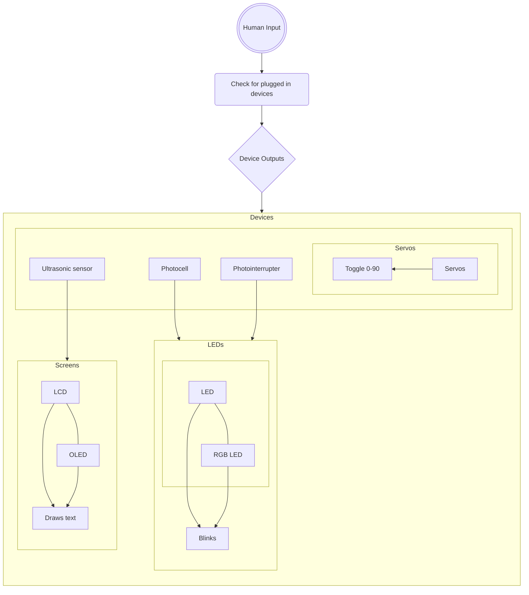
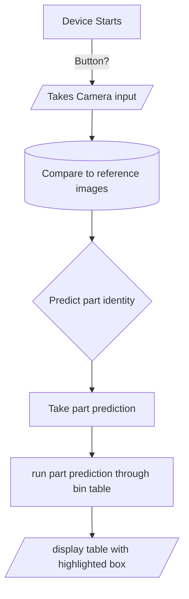

# Engineering_F.e.R.a

Able to test parts in the lab, and identify parts using A.I. recognition
<br>
<br>

## Table of Contents
* [Project F.e.](#parts-tester)
   * [Problems and Solutions](#problems-and-solutions)
   * [Description](#description)
   * [Images](#images-progress)
   * [Links](#related-links)


<br>
<br>

## Budget

<br>
$100

   * $50 = party upon completion of Project F.e.
   * $50 = party upon completion of Project R.a.
<br>
<br>
<br>


## Schedule
<br>
<br>

Parts Tester: Achievement   |   Date  |
------------- |-------- |
Research | Week 1 |
Begin Code And Wiring | Week 2 - 6 |
Begin CAD And Manufacturing | Week 2 - 6 |
Begin Assembly and Testing | Week 7 - 9 |
Final Testing | Week 10 |
Small Iterations | Week 11 |
Documentation | Week 1-11 |

<br>
<br>

AI Recognition: Achievement   |   Date  |
------------- |-------- |
Research | Week 12 |
Begin Code And Wiring | Week 13 - 17 |
Begin CAD And Manufacturing | Week 13 - 17 |
Begin Assembly and Testing | Week 18 - 20 |
Final Testing | Week 21 |
Small Iterations | Week 22 |
Documentation | Week 1-22 |


<br>
<br>
<br>

## Iteration

<br>
<br>

   * The Pseudocode for the Test Box
<br>



<br>
  *Circuit Diagram of Test Box


<br>

   * The requirements of the Test Box.
<br>


<br>
<br>

   * The views from different sides of the box. 
<br>


<br>
<br>

   * The requirements of the AI.
<br>


<br>

  * The Psuedocode for the AI.
<br>


    
<br>
<br>

## Parts Tester

<br>
<br>
<br>

### Description
A box that quickly tests certain types of parts

<br>
<br>

### Problems and Solutions

* **Problem:** We didn't remember most of the code, and syntax which made it harder to code the assignment
   
   * **Solution:** Googled different things that would be used in the code so that it could be integrated to work with one another.
 
* **Problem:** The LCD Screen consists of multiple addresses, so knowing which address goes to which LCD Screen, and how the code would integrate all of them created an obstacle.
   
   * **Solution:** Used the most popular addresses and added them to a list that the code can use to reference if an LCD Screen in the lab has it. This would allow a wider array of LCDs to be tested.

* **Problem:** The OLED Code broke the LCD screen's code by adding corrupted text on the display.
   
   * **Solution:** This ended up being an address conflict error when the OLED code found the existence of an address on the LCD. Because it did not understand how to do those things, it created the glitchy text. Just checking typical addresses first solved this problem... for now.
 
* **Problem:** A rail was soldered on the circuit board at an angle.
   
   * **Solution:** Give it a little more space on the cut for the prototype.
     
* **Problem:** A combination of senioritis and Tardies delayed the project.
  
   * **Solution:** Work harder when we are there.
 
* **Problem:** Struggle to decide whether to keep the Photo-interrupter because of the difficulty in preventing short circuits and integrating it into the Box.

   * **Solution:** Remove the part to stay on schedule, and decide whether to add it later.

* **Problem:** Having the **servo,** **RGB LED,** **LED,** and **Photo-resister** separate, and having printed brackets to each, along with their small size is inconvenient and inefficient

   * **Solution:** Have those **four parts** on a small circuit board, and then attach the circuit board to the **Box**.
 

<br>
<br>

### Coding
This is the proof of concept code (to make sure that all of the devics could function simultaneously), and the Final code, which has the logic built into it.
<details>
<summary>Proof of concept code</summary>
  
```circuitpython
  #type:ignore
  import board
  import busio
  import digitalio
  import adafruit_ssd1306
  import pwmio
  import time
  from lcd.lcd import LCD
  from lcd.i2c_pcf8574_interface import I2CPCF8574Interface
  import analogio
  from lcd.lcd import CursorMode
  import adafruit_hcsr04
  from adafruit_motor import servo
  reset_pin = digitalio.DigitalInOut(board.GP10)
  sonar = adafruit_hcsr04.HCSR04(trigger_pin=board.GP17, echo_pin=board.GP16)
  i2c_address = 0x27
  cols = 16
  rows = 2
  i2c_bus_0 = busio.I2C(board.GP15, board.GP14) # 1 rn
  interface = I2CPCF8574Interface(i2c_bus_0, i2c_address)
  lcd = LCD(interface, num_rows=rows, num_cols=cols)
  oled = adafruit_ssd1306.SSD1306_I2C(128, 64, i2c_bus_0, addr=0x3d)
  led = digitalio.DigitalInOut(board.GP13)
  led.direction = digitalio.Direction.OUTPUT
  photocell = analogio.AnalogIn(board.GP26)
  pwm_servo = pwmio.PWMOut(board.GP0, duty_cycle=2 ** 15, frequency=50)
  servo1 = servo.Servo(pwm_servo, min_pulse=500, max_pulse=2500)
  ultra=0
  cell=0
  tog=1
  per=0
  # Start at the second line, fifth column (numbering from zero).
  # Make the cursor visible as a line.
  oled.fill(0)
  oled.show()
  #Ultrasonic problem
  while True: 
      try:
          ultra=sonar.distance
          print(ultra)
          lcd.print(str(ultra))
      except RuntimeError:
          print("Retrying!")
          lcd.print("Retrying")
      cell=photocell.value
      if (cell<30000):
          led.value=True
      else:
          led.value=False
      if (per==10):
          per=0
          if (tog==1):
              servo1.angle=0
              oled.invert(True)
              tog=0
          elif (tog==0):
              servo1.angle=90
              oled.invert(False)
              tog=1
      time.sleep(0.2)
      per+=1
      lcd.clear()
```

</details>

<details>
<summary>Final code</summary>

```circuitpython
#Need to add RGB LCD OLED
#type:ignore
#Requires the imports of The following files* to Libraries
#*Or folders
#*adafruit_bus_device
#*adafruit_motor
#you need to create a folder named lcd with the __init__ i2c_pcf8574_interface and lcd
#adafruit_framebuf
#adafruit_hcsr04
#adafruit_ssd1306
#rgb.py located on the Github repo
import board
import busio#I2C
import digitalio#most boolean type outputs LED/Photointerrupter
import adafruit_ssd1306#OLED?
import pwmio#servos amd stuff
import time#time.monotonic
from lcd.lcd import LCD#LCD 
from lcd.i2c_pcf8574_interface import I2CPCF8574Interface#also LCD
import analogio#photocell/numerical returns
import adafruit_hcsr04#ultrasonic sensor
from adafruit_motor import servo#servos
from rgb import RGB#RGB LED
print("sdfgh")#are we sure that this is actually running??
#Section for devices that might as well always be loaded because them existing won't crash it and it will work as soon as plugged in
#Pins also won't change anyway
#We used pins 1,2,7,8,9,10,11,13,14,15,26
#OLED reset pin
reset_pin = digitalio.DigitalInOut(board.GP1)
#LED initialization
led = digitalio.DigitalInOut(board.GP13)
led.direction = digitalio.Direction.OUTPUT
#RGB initialization
r = board.GP7
g = board.GP8
b = board.GP9
myRGBled = RGB(r, g, b)
#Servo initialization
pwm_servo = pwmio.PWMOut(board.GP0, duty_cycle=2 ** 15, frequency=50)
servo1 = servo.Servo(pwm_servo, min_pulse=500, max_pulse=2500)
#Photocell
photocell = analogio.AnalogIn(board.GP26)
cellLed = digitalio.DigitalInOut(board.GP2)
cellLed.direction = digitalio.Direction.OUTPUT
#Ultrasonic Sensor
sonar = adafruit_hcsr04.HCSR04(trigger_pin=board.GP17, echo_pin=board.GP16)
#Photointerrupter
interrupter = digitalio.DigitalInOut(board.GP10)
interrupter.direction = digitalio.Direction.INPUT
interrupter.pull = digitalio.Pull.UP
#photointerrupter intended LED
interLed = digitalio.DigitalInOut(board.GP11)
interLed.direction = digitalio.Direction.OUTPUT
#Tracks Time.monotonic's last runtime for each device
ledTime=time.monotonic()#all lighting not integrated in the box here
ledState=False#blinks LED
rgbState=0 #switches between 0(red),1(green), and 2(blue)
altTime=time.monotonic()
altscreen=False#OLED reference
servoTime=time.monotonic()
servoState=0#servo angle
screen=False#is there currently an LCD to display on
screenTime=time.monotonic() #LCD "is this still here" test time
ultraDelay=time.monotonic()  #This is for the Ultrasonic sensor
#Photointerrupter does not need a time
addr1=0x27#add more addresses if you ever need to add a new i2c type
addr2=0x3D#one of the 2 common LCD/OLED addresses
i2c=False#has an I2C ever been plugged during this run
inv=False#this is the toggle check for OLED (screen should change black/white)
while True:
    if i2c==False or screen==False or altscreen:#area to check for any I2C device as well as either screen type(it breaks if it is attempted to be loaded when not plugged in)
        if i2c==False:#do we have I2C set yet?
            try:
                i2c_bus_0 = busio.I2C(board.GP15, board.GP14)
                i2c=True
            except RuntimeError:#luckily this can ONLY runtime error(2 types of errors do not work well for nice excepts)
                i2c=False
        if i2c==True and screen==False:#Do we have an I2C but no screen
            try:#check most common LCD address
                interface = I2CPCF8574Interface(i2c_bus_0, addr1)
                lcd = LCD(interface, num_rows=2, num_cols=16)
                screen=True
            except:
                try:#have we changed the address on this LCD?
                    interface = I2CPCF8574Interface(i2c_bus_0,addr2)
                    screen=True
                except:# may not matter because it also could just glitch it and combine OLED with LCD (may need future checkups)
                    pass
        if i2c==True and altscreen==False:#do we have an OLED right now?
            try:#check most common OLED address
                oled = adafruit_ssd1306.SSD1306_I2C(128, 64, i2c_bus_0, addr=addr2)
            except:
                try:#has it been change to LCD address?
                    oled = adafruit_ssd1306.SSD1306_I2C(128, 64, i2c_bus_0, addr=addr1)
                except:#same as line 86*subject to change(LCD check)
                    pass
            try:#try to set up OLED output
                oled.fill(0)
                oled.show()
                altscreen=True
            except:
                pass
    if time.monotonic()>=altTime+.25 and altscreen==True:#runs every 1/4 seconds
        altTime=time.monotonic()
        try:
            if inv==False:#toggles white/black
                oled.invert(True)
                inv=True
            else:
                oled.invert(False)
                inv=False
        except:#if OLED is gone there is none
            altscreen=False
    if (time.monotonic()>=screenTime+.2):#triggers evry 1/5 seconds
        screenTime=time.monotonic()
        try:#can it print anything at all?
            lcd.print(" ")
            lcd.clear()
            screen=True
        except:
            screen=False#no screen for rest of loop instance
    if (time.monotonic()>=ledTime+1):#lights every 1 second
        ledTime=time.monotonic()
        if (ledState==True):#blinks LED
            ledState=False
            led.value=False
        elif (ledState==False):
            ledState=True
            led.value=True
        if rgbState == 0:#modifies RGB LED coloration
            rgbState+=1
            myRGBled.red()
        elif rgbState == 1:
            rgbState+=1
            myRGBled.green()#green looks very pink... If you want to fix this, feel free, just wasn't really worth time
        else:
            rgbState=0
            myRGBled.blue()
    if (time.monotonic()>=servoTime+5):#servo swings every 5 seconds
        servoTime=time.monotonic()
        if servoState==0:#switch 0/90 degrees, safe pick for any type of servo
            servoState=90
        elif servoState==90:
            servoState=0
        servo1.angle=servoState
    if (time.monotonic()>=ultraDelay+.2):#ultrasonic sensro pings every 1/5 seconds
        ultraDelay=time.monotonic()
        try:#ultrasonic will break if it does not get a return ping, most ultrasonic sensor codes in this language have a try
            if (screen==True):#do we have a screen?
                try:
                    lcd.clear()
                    lcd.print(str(sonar.distance))
                except:
                    screen=False
            else:#else use serial monitor
                print(sonar.distance)
        except RuntimeError:#no return ping (either not plugged in or bounced at a bad angle)
            if (screen==True):
                try:
                    lcd.clear()
                    lcd.print("Testing")
                except:
                    screen=False
            else:#I got complaints about it printing to the serial monitor and wanted to be petty instead of writing something for a very impractical scenario because serial monitor is for bug fixing anyway
                pass
        #will run every instance ~20 times a second, I never counted, but it loops pretty quickly
        if (photocell.value>500):#if it is "dark"(may vary between photocells)-warrants checkback ***maybe switch
            cellLed.value=True
        else:
            cellLed.value=False#if normal or unplugged LED lights up
        if interrupter.value==False:#if light is blocked
            interLed.value=True
        else:
            interLed.value=False

        
```

</details>
<br>
<br>

### Images progress


<br>
<br>

### Related Links


<br>
<br>


